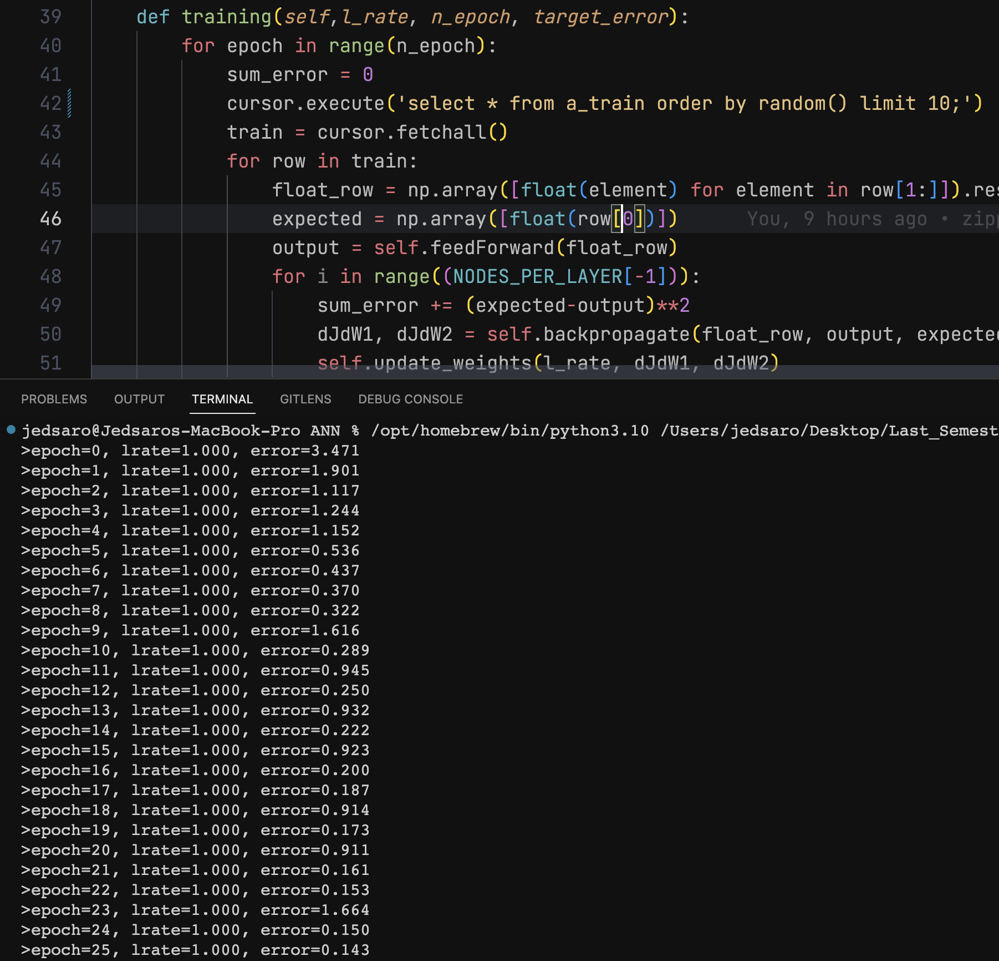

Understand the foundational computational aspects of Artificial Neural Networks  
Create a code base that can be used for future assignments 

For all test, target error was set at .1 🚀

<h1>Small Data set:</h1>

<h1>Letters:</h1>
<h2>A:</h2>

<h2>B:</h2>

<h2>C:</h2>

<h2>D:</h2>

<h2>E:</h2>

